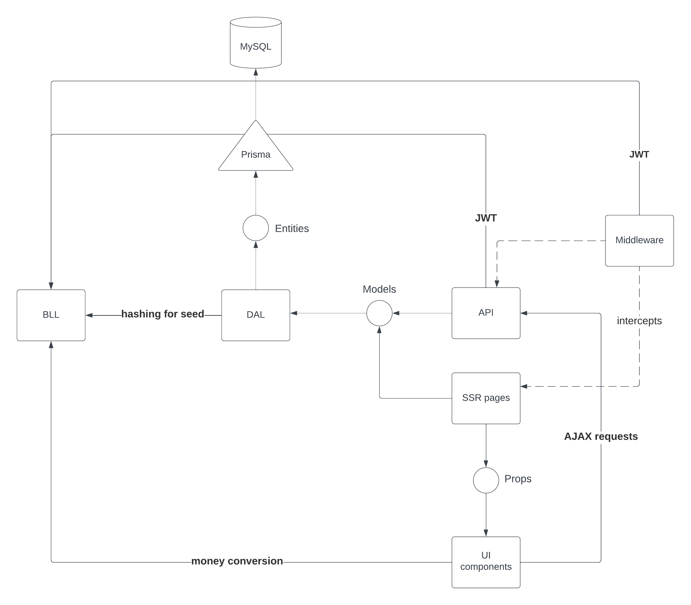
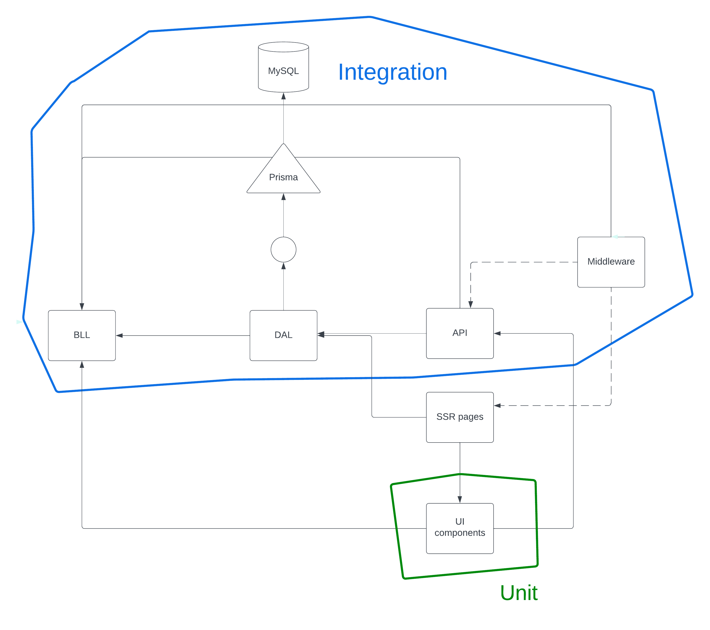
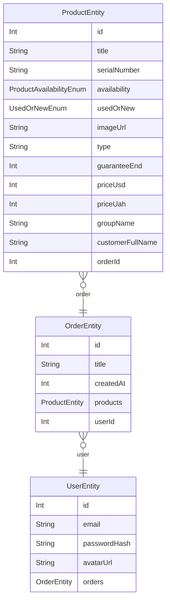

# Running

## Using docker

You can run the whole project using **Docker**:

```
npm run up
```

The app will be available at `http://localhost:3001`. There are two built-in
users on the site, one of them is a jazz guitarist. **To login**, use these credentials:

```
a@a.com
password
```

```
takanaka@seychelles.com
goblins
```

To **turn off** the whole application use:

```
npm run down
```

Note that this **leaves the mysql image on your computer**. This might be what you want. If you want to delete the `mysql` image as well, run

```
npm run down-all
```

## Without Docker

If you don't want to use Docker, you can run the app locally. This
app was tested with **MySQL 8.0.33**

After you've installed MySQL, create a database named `dzencode`. Then,
change the `DATABASE_URL` variable in `/.env` file to use port 3306:

```
DATABASE_URL=mysql://root@localhost:3306/dzencode
```

Then run

```
npm run db:setup
```

To start the app, use

```
npm run build
npm run start
```

or

```
npm run dev
```

# Overview of functions


-   `/orders` page with listing or orders

    -   Orders can be expanded to show the list of their products
    -   Both orders and products can be deleted. There's a confirmation window
        before deletion

-   `/products` page with a table of products

    -   Each product can be deleted (also with confirmation window)
    -   Products can be filtered by their type using drop menu above the table

-   Each page contains a navbar and a top panel

    -   Top panel shows current date, current time, and number of currently
        opened sessions on the website (when you open a tab, you create +1 session)

-   When you visit a page that doesn't exist, custom `404` page is shown

-   When logged in users visit `/`, they get redirected to `/orders`

-   When guests visit any protected page (`/orders`, `products`), the get
    redirected to `/login`

-   `/login` page contains login form. Email and password are validated after
    submitting the form

# Technology Stack

-   SSR app: Next.js with pages router
-   CSS: Tailwind
-   Client-side logic:
    -   `zustand` (see `Why not Redux` below)
    -   TanStack Query (React Query) for data fetching
-   Database access: Prisma + MySQL
-   Web sockets: socket.io and socket-io.client
-   API:
    -   Next.js api handlers
    -   `zod` for input validation
-   Authentication:
    -   `jose` for JWT verification/signing
    -   `bcrypt` for password hashing
-   Task runners: `package.json scripts` + `tsx` + `execa`
-   Tests:
    -   Runner: `jest` + `ts-jest` for TS support
    -   Unit tests of hooks: React Testing Library
    -   API + DB integration tests:
        -   `jest`, `axios` for requests, dockerized MySQL

# Details

## General Architecture



Note the naming:

-   Entities are objects that are stored in the database. We call entities
    with `-Entity` suffix, e.g. `OrderEntity`

-   Models are objects that represent our problem domain. Since our wesite
    is a system for tracking orders and products, our domain objects are
    `Order` and `Product`. They are called without any suffixes

-   Props are the objects that are passed to our React components. They
    are called in form `ComponentNameProps`, e.g. `OrderListProps`

## Tests

### Overview

We use two kinds of tests in this project: **unit** and **integration**.

Unit tests test React hooks used on client side. Integration tests cover
API + Authentication + Database access.

Here's a diagram showing which tests cover which parts of the system:



### Running

To run unit tests:

```
npm run test:unit
```

To run api (integration) tests:

```
npm run test:api
```

## DB

### Schema



### Queries

See detailed description of SQL queries, see [this file](./docs/queries.md)

## NPM scripts

-   `up` - start the whole app in Docker Compose
-   `down` - turns off the app started by `up`
-   `down-all` turns off the app like `down`, and also deletes `mysql`
    docker image
-   `docker:build` - build images of the Next.js app (called `docker-app`)
-   `docker:save` - exports the image of the Next.js app into `./docker/app.tar`. I used it for deployment
-   `lint`, `dev`, `start`, `build` - standard Next.js commands
-   `db`:
    -   `db:start` - run MySQL docker container on port 330**7**
    -   `db:stop` - stop the MySQL container
    -   `db:migrate` - connect to the DB specified in `.env` in `DATABASE_URL` and run migrations (bootstrap schema)
    -   `db:seed` connect to database like `db:migrate`, and fill it with mock
        data
    -   `db:setup` - runs both `db:migrate` and `db:seed`
    -   `db` - shortcut for `docker compose -f /path/to/mysql/compose.yml`. Can be used like `npm run db up --build --force-recreate`
-   `test:unit` and `test:api` - described above

## Security

We use JWT in this project. How should we pass it from server to client and
vice versa?

Generally, there are two ways to pass/store JWT:

Cookies:

-   Pros:
    -   If marked as `HttpOnly`, they cannot be stolen via `XSS` attack
    -   If marked as `Secure`, they will never be sent unencrypted, and thus cannot be stolen by sniffing traffic
-   Cons:
    -   Cookies are prone to `CSRF` attacks. This can be mitigated by setting `SameSite: Strict` attribute. This attribute, however, if too strict for our app. We can use `SameSite: Lax`, but this leaves `GET` endpoints vulnerable. `GET` endpoints shouldn't do side effects, but this is not enforced in any way

`localStorage`:

-   Pros:
    -   Immune to `CSRF` attacks
-   Cons:
    -   Does not enforce `HTTPS`
    -   Can be stolen if the site has `XSS` vulnerability

I've chosen cookies because the website uses SSR. To visit protected
SSR page, you need to somehow pass your JWT token. The only way to
do that with `localStorage` is to first load some JS code that will
grab the token from `localStorage` and send it - this is not SSR

I've used special attributes on cookie to make it more secure:

-   Per OWASP recommendation, I've called it `id` - not very descriptive
    name to hide details about tech stack I use
-   I've set `Secure` and `HttpOnly`
-   I've set `SameSite: Lax`

At the moment **there's not protection against CSRF on GET routes**.
This is not an issue, because `GET` requests in this app don't mutate
state
